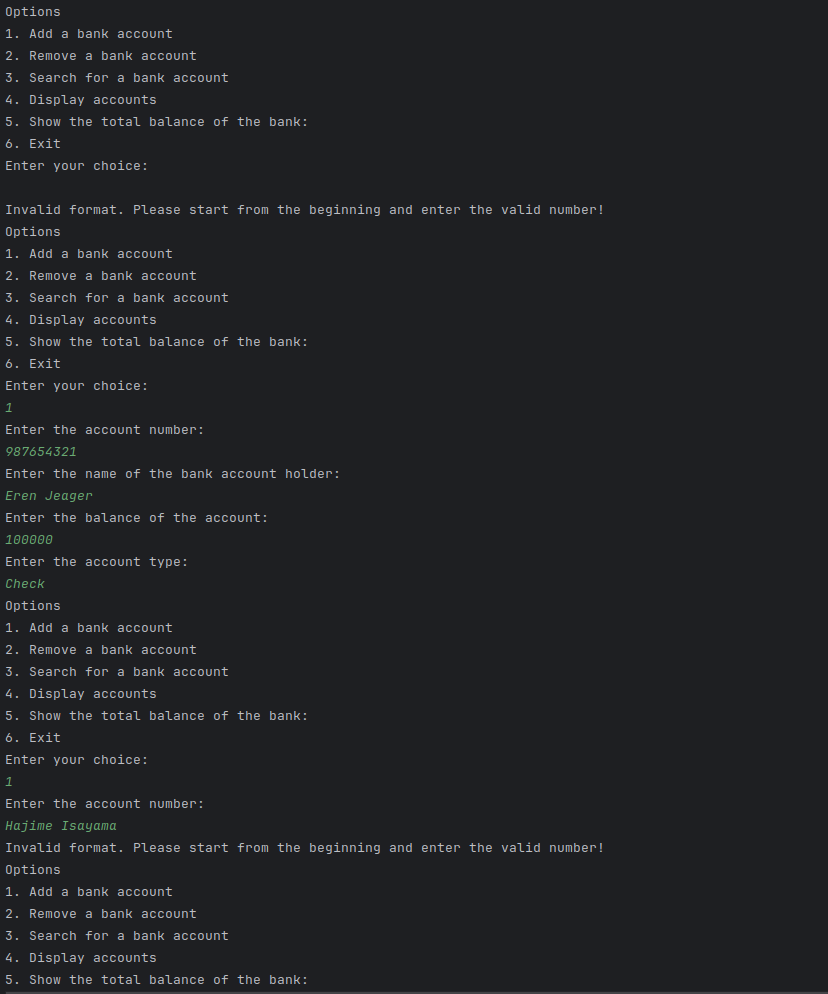
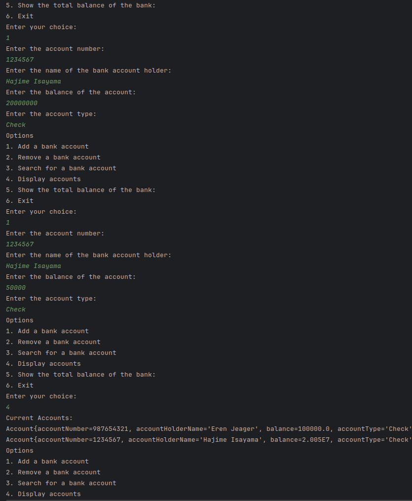
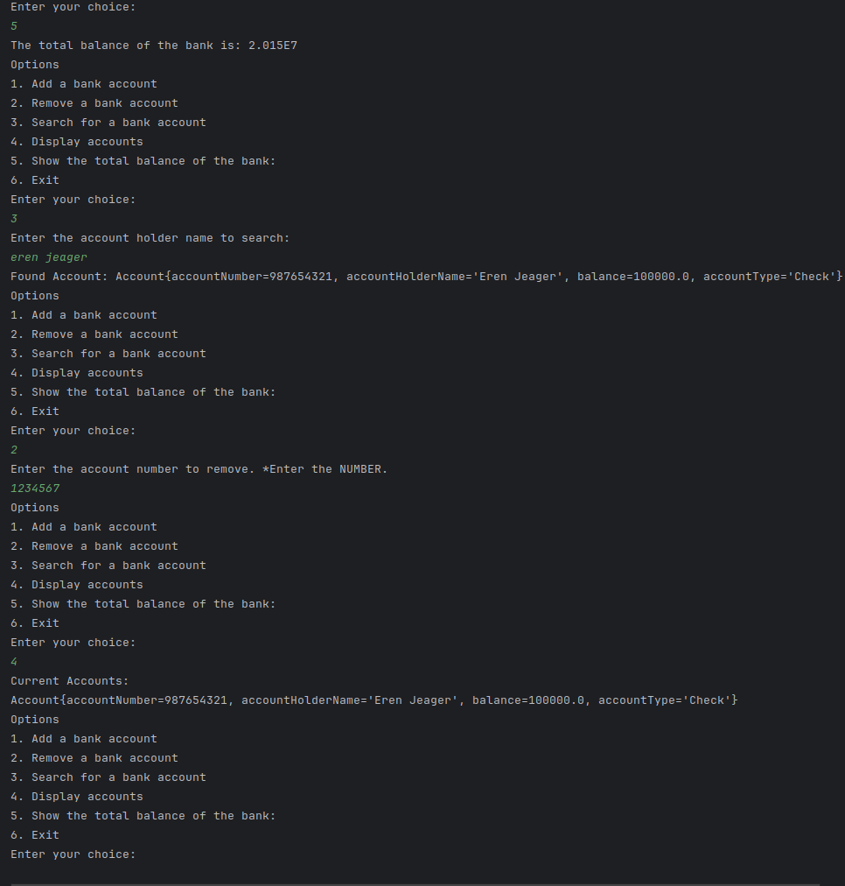

# Banking Application-with-ArrayList
This was my assignment for my Java online course. The directory is private in the organisation group in GitHub and I created my own repository here.
I posted the similar repository for online Book Store Inventory application with for-loop(https://github.com/chizuru-nina-yamauchi/Online-Book-Store-Inventory-with-for-loop).
This assignment, I did with ArrayList.
The result photos in the end.
---
Level of Difficulty: Intermediate
Title: Advanced Online Banking System
Overview:
In this assignment, you will be creating an advanced banking system. The system will be able to add accounts, remove accounts, and display the current accounts. Each account will have an account number, account holder's name, balance, and account type. You will be using access modifiers, packages, ArrayList and LinkedList to accomplish this task.

Step Guidance:

Accept the GitHub Classroom invitation that was sent to your email. This will create a new repository for you to submit your assignment.
Clone the repository to your local machine using the command git clone [repository url].
Create a proper project structure with the appropriate packages and classes.
Create a new package named banking. Inside this package, create two classes: Account and Bank.
In the Account class, declare private attributes for account number, account holder's name, balance, and account type. Include a constructor to initialize these attributes, getters and setters to access and modify them, and a toString method to display the account information.
In the Bank class, declare a private ArrayList of Account objects. This ArrayList will represent the accounts in the bank. Include methods to add an account (which should add an Account object to the ArrayList), remove an account (which should remove an Account object from the ArrayList based on the account number), and display the current accounts (which should print all the Account objects in the ArrayList).
In the main method, which should be in a separate class in the default package, create an instance of the Bank class and add some accounts to the bank. Then display the accounts, remove an account, and display the accounts again to ensure everything is working correctly.
Once you have completed your solution, commit your changes using the command git commit -m "Completed assignment".
Push your changes to the repository using the command git push origin master.
Make sure to complete these steps Today before 16:00.
Examples: Input: Add Account: (123456, "John Doe", 5000.00, "Savings") Add Account: (789012, "Jane Doe", 10000.00, "Checking") Display Accounts Remove Account: 123456 Display Accounts

Output: Accounts: Account Number: 123456, Account Holder: John Doe, Balance: $5000.00, Account Type: Savings Account Number: 789012, Account Holder: Jane Doe, Balance: $10000.00, Account Type: Checking

Accounts: Account Number: 789012, Account Holder: Jane Doe, Balance: $10000.00, Account Type: Checking

Notes: Remember to use the principles of object-oriented programming. Each class should have a single responsibility. The Account class should only be concerned with account-related tasks, and the Bank class should only be concerned with bank-related tasks. Also, remember to use access modifiers to encapsulate your data and protect it from being accessed directly.

Bonus: Add a feature to the Bank class that allows you to search for an account by account number or account holder's name. This method should take a string as a parameter and search the ArrayList of Account objects for a match. If a match is found, it should return the Account object. If no match is found, it should return null.

Input: Search Account: "Jane Doe"

Output: Account Number: 789012, Account Holder: Jane Doe, Balance: $10000.00, Account Type: Checking

Also, add a feature that displays the total balance of the bank (the sum of the balance of each account). This method should iterate over the ArrayList of Account objects, calculate the total balance for each account, and sum these balances.

Input: Calculate Total Balance/
Output: Total Balance: $15000.00
---
## Result

### What I used
Java, IntelliJ, Markdown, GitHub

### What I used in Java file
Switch, While, Constructor, Getter and Setter, for-each loop, for loop, ArrayList, 